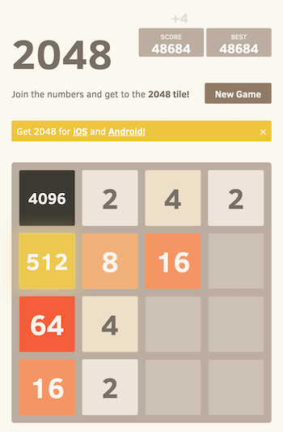
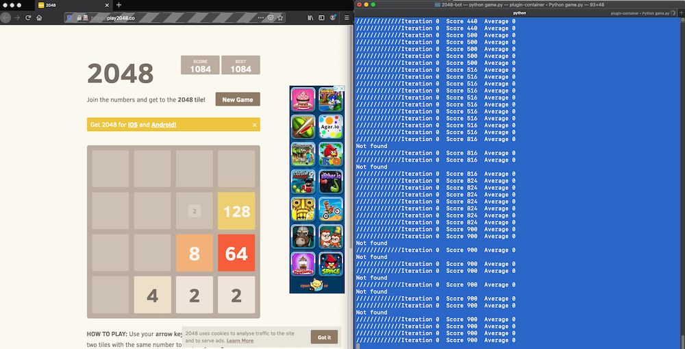
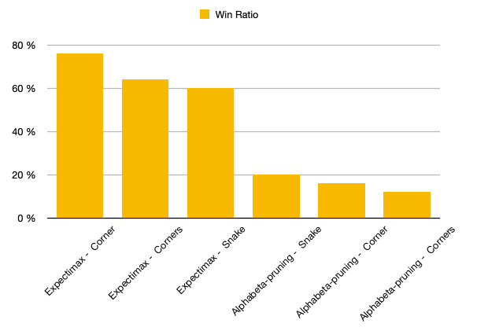
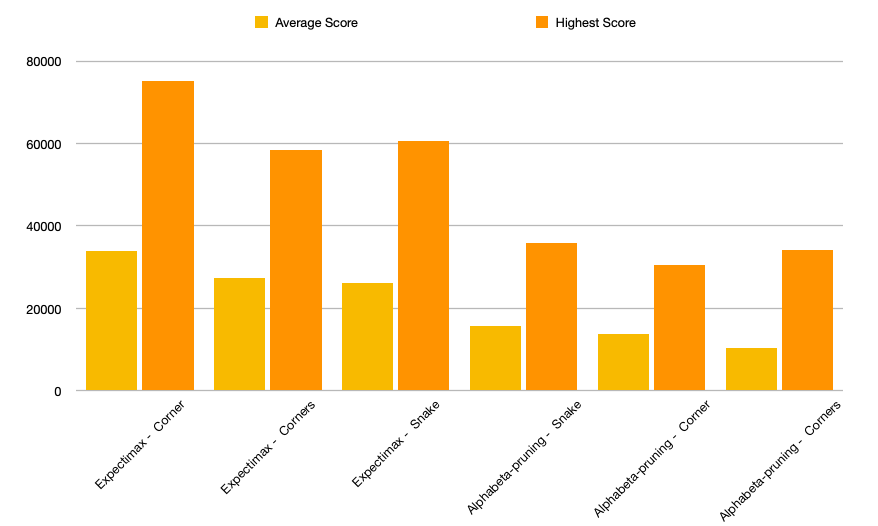
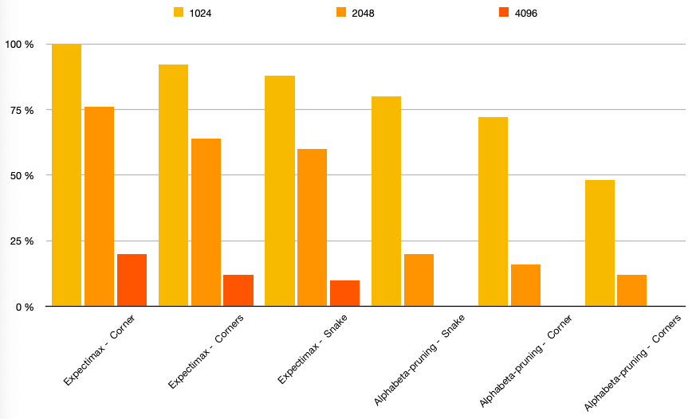

2048-AI
===============

This project aims to solve the 2048-game with AI. This game was a suitable candidate to start
solving (video) games with AI. With the [Selenium](https://www.selenium.dev) it's easy to open the web-page
 with the game and dive into the html-code and read the numbers. Selenium can also send the keyboard commands
 needed.

To find out if an algorithm was performing well, each algorithm was executed many times to be able to draw conclusions. In each execution, information such as score and tile scores were sampled to compute average score, win ratio and high score.



## Run it on your computer

Preferably, create a new virtual python environment and execute the following command in a
terminal window:

```bash
pip install -r requirements.txt
```

If you don't have Firefox installed, you must change the code in `game.py`:

```python
class Game2048:

    def __init__(self):
        self.browser = webdriver.Firefox(executable_path='/usr/local/bin/geckodriver')
```

to your own browser, such as Safari. However, Firefox is recommended.

Note, the software has only been tested on Max OS X, but should work without any problem on Ubuntu.

Run the AI with:

```python
python game.py
```

and you should see something like this:



## Algorithms
In this project, there are two algorithms available to solve the game, Alpha-beta pruning and Expectimax.
They use heuristics, a computed score, as a way to measure how good a move is. For instance, if the AI has
four moves available, UP, LEFT, RIGHT and DOWN, the AI will compute the heuristic value for each move and
save the move that has the best heuristic score.

The algorithms use a recursive depth to find the next move, and the next move after that, which with a bit
of luck will lead to a sequence of smart moves to maximize the score. When the depths is too big, it will
take very long time to compute the scores. One way to make it run faster is to use the depth as a brake.
If there are many empty tiles, then the cost of making a bad move is not that expensive, but when there are
few tiles emtpy, then it's very expensive to make a bad move. See the picture above, we don't want a 2 in
the position where the 4096 tile is, that would be a bad move. So spending more time to find a move that
will not lead to that situation is worth more than speed.

### Alphabeta-pruning
>Alpha–beta pruning is a search algorithm that seeks to decrease the number of nodes that are evaluated
>by the minimax algorithm in its search tree. It is an adversarial search algorithm used commonly for
>machine playing of two-player games (Tic-tac-toe, Chess, Go, etc.). It stops evaluating a move when at
>least one possibility has been found that proves the move to be worse than a previously examined move.
>Such moves need not be evaluated further. When applied to a standard minimax tree, it returns the same
>move as minimax would, but prunes away branches that cannot possibly influence the final decision. [Wikipedia](https://en.wikipedia.org/wiki/Alpha–beta_pruning)

### Expectimax
>The expectiminimax algorithm is a variation of the minimax algorithm, for use in artificial intelligence
>systems that play two-player zero-sum games, such as backgammon, in which the outcome depends on a
>combination of the player's skill and chance elements such as dice rolls. In addition to "min" and "max"
>nodes of the traditional minimax tree, this variant has "chance" ("move by nature") nodes, which take the
>expected value of a random event occurring.[1] In game theory terms, an expectiminimax tree is the game
>tree of an extensive-form game of perfect, but incomplete information. [Wikipedia](https://en.wikipedia.org/wiki/Expectiminimax)

### Heuristics
The AI has three heuristics, they are called `Corner`, `Corners` and `Snake`. They are used to calculate
a score of the current content in the game. The basic idea is to keep large values at some corner. To calculate
the score, the 2048-grid is computed with a 4x4 matrix containing weights. Each cell is typically multiplied
with the same cell in the weight-matrix, and the sum is used as the score.

`Corner` will give a higher score if the 2048-grid has it's large values in the upper left corner.

`Corners` will give a higher score if the 2048-grid has it's large values at any corner, but will also
give a penalty if the values are spread.

`Snake` will give a higher score if the 2048-grid is oriented like a snake, which means that the values from
high to low or vice versa, like this:


or like this


and so forth.

## Results

To generate the results below, each algorithm in combination with a heuristic was run 50 times.

The table below shows the average, highest scores and the win ratio for all algorithms and heuristics.
It also shows the probability of getting a 1024, 2048 and 4096 each.

|           |Corner|Corners|Snake|Corner|Corners|Snake|
|---|---|---|---|---|---|---|
||Expectimax|Expectimax|Expectimax|Alphabeta|Alphabeta|Alphabeta|
|Average    |34 000 |27 318 |26 141 |13 737 |10 345 |15 755 |
|Highest    |75 040 |60 720 |60 720 |30 568 |32248  |35 948 |
|Win ratio  |76 %   |60 %   |60%    |16 %   |12 %   |20 %   |
|1024       |100%   |92 %   |88 %   |72 %   |48 %   |80 %   |
|2048       |76%    |64%    |60 %   |16 %   |12 %   |20 %   |
|4096       |20 %   |12 %   |10 %   |0 %    |0 %    |0  %   |









## References
1. [AI Plays 2048, Yun Nie et al.](http://cs229.stanford.edu/proj2016/report/NieHouAn-AIPlays2048-report.pdf)
2. [2048 solver, Michelle Fried et al.](https://www.cse.huji.ac.il/~ai/projects/2014/2048Solver/files/report.pdf)

